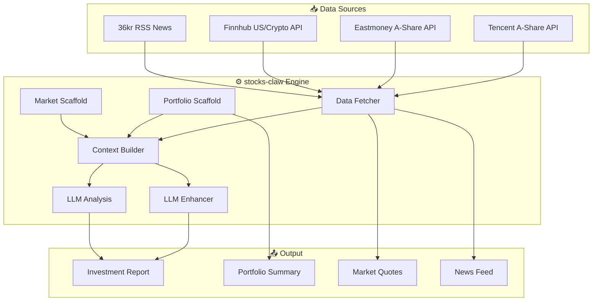

<div align="center">

# 🦅 stocks-claw

**Personal Investment Advisor — Multi-source market data + LLM-driven analysis**

[](https://www.python.org/)
[](LICENSE)
[](NAS_DEPLOYMENT.md)
[](requirements.txt)

[English](README.md) · [中文](README.zh.md) · [Agent Guide](AGENT_GUIDE.md) · [NAS Deploy](NAS_DEPLOYMENT.md)

</div>

---

## 📋 Table of Contents

- [Overview](#-overview)
- [Features](#-features)
- [Architecture](#-architecture)
- [Quick Start](#-quick-start)
- [Installation](#-installation)
- [Usage](#-usage)
- [API Reference](#-api-reference)
- [Configuration](#-configuration)
- [Project Structure](#-project-structure)
- [Documentation](#-documentation)
- [Deployment](#-deployment)
- [Disclaimer](#-disclaimer)
- [License](#-license)

---

## 🎯 Overview

**stocks-claw** is a personal investment advisory toolkit that integrates multi-source financial market data and leverages LLM to generate personalized investment advice.

> **Positioning: Agent Capability Extension Toolkit** — Deployed in your Agent workspace (OpenClaw / Hermes / Kimi Work), invoked via CLI or HTTP API.

**Key Design Principles:**
- 🔒 **Privacy-first** — Real asset data stays in `.local/` (git-ignored)
- 🧠 **LLM-native** — Program provides reliable input & scaffolding; LLM generates advice
- 🌐 **Multi-market** — A-shares, US stocks, crypto via unified interface
- 📡 **Zero-dependency** — Pure Python standard library, no pip install required

---

## ✨ Features

| Feature | Description | Status |
|---------|-------------|--------|
| 📊 **Asset Management** | CRUD for financial assets with multi-currency support | ✅ |
| 📈 **Multi-market Quotes** | A-shares (Tencent/Eastmoney), US stocks, crypto (Finnhub) | ✅ |
| 📰 **News Tracking** | 36kr RSS feed (no API key needed) | ✅ |
| 🤖 **LLM Analysis** | DeepSeek / Kimi / OpenAI-compatible models | ✅ |
| 🔍 **Portfolio Drift** | Constraint-based deviation detection | ✅ |
| 🐳 **Docker Ready** | One-command deployment on NAS / VPS | ✅ |
| 🔌 **HTTP API** | RESTful JSON API for Agent integration | ✅ |
| 📝 **Report Generation** | Markdown investment reports with market context | ✅ |

---

## 🏗️ Architecture



---

## 🚀 Quick Start

> **For AI Agents:** Read [`AGENT_GUIDE.md`](AGENT_GUIDE.md) first.
>
> **For Users:** Hand this repo to your AI assistant and let it guide you.

### Prerequisites

- Python 3.9+
- (Optional) Docker for NAS deployment
- (Optional) Finnhub API key for US stocks / crypto

### 1-Minute Setup

```bash
# Clone the repository
git clone https://github.com/yourusername/stocks-claw.git
cd stocks-claw

# Configure API keys (optional — A-shares & news work without keys)
echo "your-finnhub-key" > .secret/finnhub-key.md
echo "your-openai-key" > .secret/openai-key.md
echo "http://your-llm-proxy:8317/v1" > .secret/openai-base-url.md

# Add your assets (privacy-safe, stored in .local/)
cp stocks/data/financial_assets.json .local/financial_assets.json
# Edit .local/financial_assets.json with your real holdings

# Run a quick health check
python3 -m stocks.tests.test_v2
```

---

## 📦 Installation

### Option A: Local (MacBook / Linux)

```bash
# No pip install needed — pure stdlib
python3 -m stocks.adapters.cli --output text --no-news
```

### Option B: Docker (NAS / Server)

```bash
# Build and run
docker build -t stocks-claw .
docker run -d \
  --name stocks-claw \
  -p 8687:8687 \
  -v $(pwd)/.local:/app/.local \
  -v $(pwd)/.secret:/app/.secret \
  stocks-claw

# Verify
curl http://localhost:8687/api/v1/health
```

### Option C: Docker Compose (Unraid NAS)

See [`NAS_DEPLOYMENT.md`](NAS_DEPLOYMENT.md) for full Unraid setup with Hermes Agent integration.

---

## 🎮 Usage

### CLI Mode

```bash
# Generate full investment report
python3 -m stocks.adapters.cli --output text

# Get portfolio summary only
python3 -c "
from stocks.engine import StocksEngine
engine = StocksEngine()
assets = engine.load_assets()
mapping = engine.analyze_portfolio(assets)
print(f'Total: ¥{sum(a.amount for a in assets):,.2f}')
"

# Fetch A-share quotes
python3 -c "
import asyncio
from stocks.engine import StocksEngine
engine = StocksEngine()
quotes = asyncio.run(engine.fetch_quotes(market='a'))
for q in quotes.get('a', []):
    print(f'{q.instrument.name}: {q.price}')
"
```

### HTTP API Mode

```bash
# Health check
curl http://localhost:8687/api/v1/health

# Portfolio summary
curl -X POST http://localhost:8687/api/v1/portfolio/summary \
  -H "Content-Type: application/json" -d '{}'

# Full analysis with LLM report (takes ~30s)
curl -X POST http://localhost:8687/api/v1/analysis/context \
  -H "Content-Type: application/json" \
  -d '{"include_news": true, "include_quotes": true}'
```

### Programmatic (Python)

```python
import asyncio
from stocks.engine import StocksEngine
from stocks.domain.models import FinancialAsset

async def main():
    engine = StocksEngine()
    
    # Load & analyze portfolio
    assets = engine.load_assets()
    mapping = engine.analyze_portfolio(assets)
    drift = engine.detect_drift(mapping)
    
    # Fetch market data
    quotes = await engine.fetch_quotes()
    news = await engine.fetch_news(limit=5)
    
    # Generate LLM report
    context = await engine.build_context()
    report = await engine.generate_report(context)
    print(report)

asyncio.run(main())
```

---

## 📡 API Reference

| Endpoint | Method | Description | Example Body |
|----------|--------|-------------|--------------|
| `/api/v1/health` | `GET` | System health check | — |
| `/api/v1/portfolio/summary` | `POST` | Portfolio + drift analysis | `{}` |
| `/api/v1/quotes` | `POST` | Real-time quotes | `{"market": "a"}` |
| `/api/v1/news` | `POST` | Latest news feed | `{"limit": 5}` |
| `/api/v1/analysis/context` | `POST` | Full context + LLM report | `{"include_news": true}` |

> **Note:** `analysis/context` invokes LLM and may take 20–60s. Configure your Agent's timeout accordingly.

---

## ⚙️ Configuration

### File Layout

```
stocks-claw/
├── .local/                    # 🔒 Privacy data (git-ignored)
│   └── financial_assets.json  # Your real holdings
├── .secret/                   # 🔒 API keys (git-ignored)
│   ├── finnhub-key.md
│   ├── openai-key.md
│   └── openai-base-url.md
├── stocks/config/
│   ├── watchlist.json         # Instruments to track
│   ├── markets.json           # Provider mapping
│   └── portfolio_constraints.json  # Allocation rules
└── stocks/data/
    └── financial_assets.json  # Template assets
```

### Asset Format (`.local/financial_assets.json`)

```json
[
  {
    "name": "科创50ETF华夏",
    "platform": "券商A股",
    "amount": 3071.0,
    "asset_type": "股票ETF",
    "notes": "588000，1800股",
    "confirmed": true,
    "currency": "CNY"
  }
]
```

### Watchlist Format (`stocks/config/watchlist.json`)

```json
[
  {"code": "000300", "name": "沪深300", "market": "a", "exchange": "sz_index"},
  {"code": "QQQ", "name": "纳斯达克100ETF", "market": "us"},
  {"code": "BTCUSDT", "name": "比特币", "market": "crypto"}
]
```

---

## 📁 Project Structure

<details>
<summary>Click to expand full directory tree</summary>

```
stocks-claw/
├── 📄 README.md                    # This file
├── 📄 README.zh.md                 # 中文版本
├── 📄 LICENSE                      # MIT License
├── 📄 requirements.txt             # (stdlib only)
├── 📄 AGENT_GUIDE.md               # ⭐ AI Agent deployment guide
├── 📄 NAS_DEPLOYMENT.md            # 🐳 NAS / Docker / Hermes setup
├── 📄 Dockerfile                   # Docker image definition
├── 📄 docker-compose.yml           # Docker Compose config
│
├── 🔒 .local/                      # Privacy data (git-ignored)
├── 🔒 .secret/                     # API keys (git-ignored)
│
├── 📁 stocks/
│   ├── 📁 engine/                  # Core engine
│   │   ├── __init__.py             # StocksEngine facade
│   │   ├── context_builder.py      # AnalysisContext assembler
│   │   ├── fetchers.py             # Parallel data fetching
│   │   ├── scaffolds.py            # Portfolio & market scaffolding
│   │   ├── llm_enhancer.py         # LLM data enhancement
│   │   ├── llm_analysis.py         # LLM report generation
│   │   ├── exchange_rate.py        # Multi-currency conversion
│   │   └── persistence.py          # Snapshot history
│   │
│   ├── 📁 providers/               # Data providers
│   │   ├── tencent_a.py            # A-share via Tencent API
│   │   ├── eastmoney_a.py          # A-share via Eastmoney API
│   │   ├── finnhub_quote.py        # US stocks & crypto via Finnhub
│   │   ├── rss_news.py             # 36kr RSS news feed
│   │   └── registry.py             # Provider registry
│   │
│   ├── 📁 domain/                  # Domain models
│   │   └── models.py               # FinancialAsset, Quote, NewsItem, etc.
│   │
│   ├── 📁 adapters/                # Interface adapters
│   │   ├── cli.py                  # Command-line interface
│   │   ├── http.py                 # HTTP REST API server
│   │   └── mcp.py                  # MCP protocol adapter
│   │
│   ├── 📁 config/                  # Configuration files
│   ├── 📁 data/                    # Default data templates
│   └── 📁 tests/                   # Test suite
│
└── 📁 docs/                        # Additional documentation
    ├── ARCHITECTURE.md             # System architecture
    ├── DATA_MODEL.md               # Data model reference
    ├── DATA_SOURCES.md             # Data source configuration
    └── DESIGN.md                   # Design principles
```

</details>

---

## 📚 Documentation

| Document | Description |
|----------|-------------|
| [`AGENT_GUIDE.md`](AGENT_GUIDE.md) | 🎯 AI Agent deployment & configuration guide |
| [`NAS_DEPLOYMENT.md`](NAS_DEPLOYMENT.md) | 🐳 Docker / NAS / Hermes Agent integration |
| [`stocks/ARCHITECTURE.md`](stocks/ARCHITECTURE.md) | 🏗️ System architecture & design principles |
| [`stocks/DATA_MODEL.md`](stocks/DATA_MODEL.md) | 📊 Data models & JSON schemas |
| [`stocks/DATA_SOURCES.md`](stocks/DATA_SOURCES.md) | 📡 Data source configuration guide |
| [`stocks/DESIGN.md`](stocks/DESIGN.md) | 🎨 Design decisions & trade-offs |

---

## 🚀 Deployment Options

| Platform | Method | Guide |
|----------|--------|-------|
| 💻 Local | Python CLI | [Quick Start](#-quick-start) |
| 🐳 Docker | `docker run` | [Dockerfile](Dockerfile) |
| 🖥️ NAS (Unraid) | Docker Compose | [`NAS_DEPLOYMENT.md`](NAS_DEPLOYMENT.md) |
| 🤖 Hermes Agent | HTTP API Skill | [`NAS_DEPLOYMENT.md`](NAS_DEPLOYMENT.md) |
| ☁️ VPS | Docker + systemd | (coming soon) |

---

## ⚠️ Disclaimer

> **This system is for educational and reference purposes only. It does not constitute investment advice.**
>
> Investing involves risks. All decisions are your own responsibility. The LLM-generated reports are analytical opinions, not financial recommendations.

---

## 📜 License

[MIT License](LICENSE) © 2026 stocks-claw contributors

---

<div align="center">

**Built for OpenClaw · Hermes Agent · Kimi Work**

⭐ Star this repo if you find it useful!

</div>
