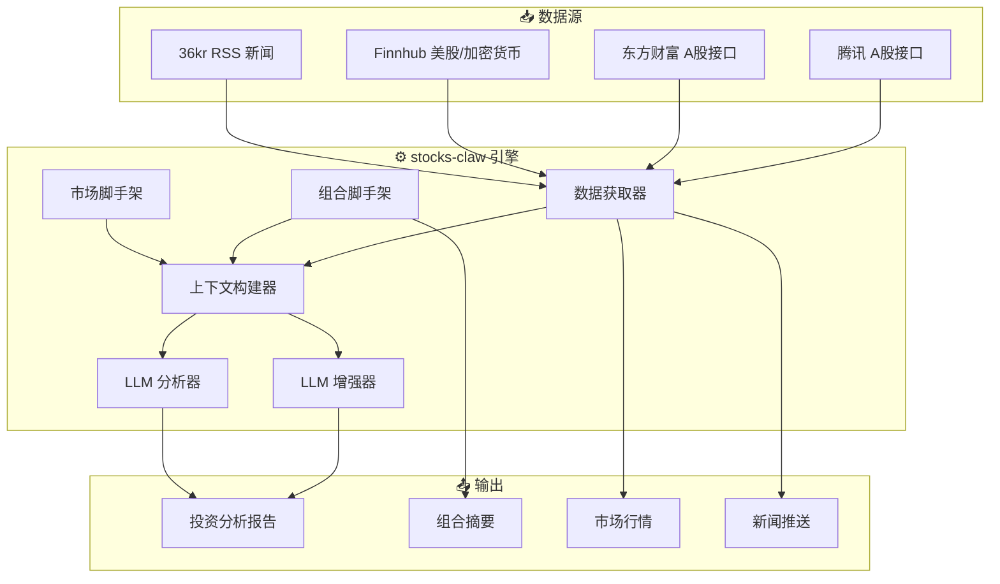

<div align="center">

# 🦅 stocks-claw

**个人投资顾问系统 — 多源市场数据 + LLM 驱动分析**

[](https://www.python.org/)
[](LICENSE)
[](NAS_DEPLOYMENT.md)
[](requirements.txt)

[English](README.md) · [中文](README.zh.md) · [Agent 指南](AGENT_GUIDE.md) · [NAS 部署](NAS_DEPLOYMENT.md)

</div>

---

## 📋 目录

- [项目概览](#-项目概览)
- [核心特性](#-核心特性)
- [系统架构](#-系统架构)
- [快速开始](#-快速开始)
- [安装部署](#-安装部署)
- [使用方式](#-使用方式)
- [API 参考](#-api-参考)
- [配置说明](#-配置说明)
- [项目结构](#-项目结构)
- [文档索引](#-文档索引)
- [部署方案](#-部署方案)
- [免责声明](#-免责声明)
- [开源协议](#-开源协议)

---

## 🎯 项目概览

**stocks-claw** 是一个个人投资顾问工具包，整合多源金融市场数据，利用 LLM 生成个性化投资建议。

> **定位：Agent 能力扩展工具包** —— 部署在 Agent 工作区（OpenClaw / Hermes / Kimi Work）中，通过 CLI 或 HTTP API 调用。

**核心设计原则：**
- 🔒 **隐私优先** — 真实资产数据存放在 `.local/`（git-ignored）
- 🧠 **LLM 原生** — 程序提供可靠输入与脚手架，LLM 生成投资建议
- 🌐 **多市场** — A股、美股、加密货币统一接口
- 📡 **零依赖** — 纯 Python 标准库，无需 pip 安装

---

## ✨ 核心特性

| 特性 | 说明 | 状态 |
|------|------|------|
| 📊 **资产管理** | 金融资产 CRUD，支持多币种 | ✅ |
| 📈 **多市场行情** | A股（腾讯/东方财富）、美股、加密货币（Finnhub） | ✅ |
| 📰 **新闻追踪** | 36kr RSS 源（无需 API Key） | ✅ |
| 🤖 **LLM 分析** | 支持 DeepSeek / Kimi / OpenAI 兼容模型 | ✅ |
| 🔍 **组合偏离** | 基于约束条件的偏离检测 | ✅ |
| 🐳 **Docker 就绪** | NAS / VPS 一键部署 | ✅ |
| 🔌 **HTTP API** | RESTful JSON API，方便 Agent 集成 | ✅ |
| 📝 **报告生成** | 带市场上下文的投资分析报告 | ✅ |

---

## 🏗️ 系统架构



---

## 🚀 快速开始

> **AI Agent：** 请先阅读 [`AGENT_GUIDE.md`](AGENT_GUIDE.md)。
>
> **普通用户：** 将本仓库交给你的 AI 助手，让它读取 `AGENT_GUIDE.md` 后协助你完成配置。

### 前置条件

- Python 3.9+
- （可选）Docker，用于 NAS 部署
- （可选）Finnhub API Key，用于美股/加密货币行情

### 1 分钟快速配置

```bash
# 克隆仓库
git clone https://github.com/yourusername/stocks-claw.git
cd stocks-claw

# 配置 API Key（可选 — A股和新闻无需 Key 即可工作）
echo "your-finnhub-key" > .secret/finnhub-key.md
echo "your-openai-key" > .secret/openai-key.md
echo "http://your-llm-proxy:8317/v1" > .secret/openai-base-url.md

# 添加你的资产（隐私安全，存储在 .local/）
cp stocks/data/financial_assets.json .local/financial_assets.json
# 编辑 .local/financial_assets.json 填入真实持仓

# 运行健康检查
python3 -m stocks.tests.test_v2
```

---

## 📦 安装部署

### 方案 A：本地（MacBook / Linux）

```bash
# 无需 pip 安装 — 纯标准库
python3 -m stocks.adapters.cli --output text --no-news
```

### 方案 B：Docker（NAS / 服务器）

```bash
# 构建并运行
docker build -t stocks-claw .
docker run -d \
  --name stocks-claw \
  -p 8687:8687 \
  -v $(pwd)/.local:/app/.local \
  -v $(pwd)/.secret:/app/.secret \
  stocks-claw

# 验证
curl http://localhost:8687/api/v1/health
```

### 方案 C：Docker Compose（Unraid NAS）

详见 [`NAS_DEPLOYMENT.md`](NAS_DEPLOYMENT.md) 完整的 Unraid + Hermes Agent 集成指南。

---

## 🎮 使用方式

### CLI 模式

```bash
# 生成完整投资报告
python3 -m stocks.adapters.cli --output text

# 仅获取组合摘要
python3 -c "
from stocks.engine import StocksEngine
engine = StocksEngine()
assets = engine.load_assets()
mapping = engine.analyze_portfolio(assets)
print(f'总资产: ¥{sum(a.amount for a in assets):,.2f}')
"

# 获取 A股行情
python3 -c "
import asyncio
from stocks.engine import StocksEngine
engine = StocksEngine()
quotes = asyncio.run(engine.fetch_quotes(market='a'))
for q in quotes.get('a', []):
    print(f'{q.instrument.name}: {q.price}')
"
```

### HTTP API 模式

```bash
# 健康检查
curl http://localhost:8687/api/v1/health

# 组合摘要
curl -X POST http://localhost:8687/api/v1/portfolio/summary \
  -H "Content-Type: application/json" -d '{}'

# 完整分析（含 LLM 报告，约 30 秒）
curl -X POST http://localhost:8687/api/v1/analysis/context \
  -H "Content-Type: application/json" \
  -d '{"include_news": true, "include_quotes": true}'
```

### 编程调用（Python）

```python
import asyncio
from stocks.engine import StocksEngine
from stocks.domain.models import FinancialAsset

async def main():
    engine = StocksEngine()
    
    # 加载并分析组合
    assets = engine.load_assets()
    mapping = engine.analyze_portfolio(assets)
    drift = engine.detect_drift(mapping)
    
    # 获取市场数据
    quotes = await engine.fetch_quotes()
    news = await engine.fetch_news(limit=5)
    
    # 生成 LLM 报告
    context = await engine.build_context()
    report = await engine.generate_report(context)
    print(report)

asyncio.run(main())
```

---

## 📡 API 参考

| 端点 | 方法 | 说明 | 请求体示例 |
|------|------|------|-----------|
| `/api/v1/health` | `GET` | 系统健康检查 | — |
| `/api/v1/portfolio/summary` | `POST` | 组合摘要 + 偏离分析 | `{}` |
| `/api/v1/quotes` | `POST` | 实时行情 | `{"market": "a"}` |
| `/api/v1/news` | `POST` | 最新新闻 | `{"limit": 5}` |
| `/api/v1/analysis/context` | `POST` | 完整上下文 + LLM 报告 | `{"include_news": true}` |

> **注意：** `analysis/context` 端点会调用 LLM，响应时间约 20–60 秒。请在 Agent 中配置足够的超时时间。

---

## ⚙️ 配置说明

### 文件布局

```
stocks-claw/
├── .local/                    # 🔒 隐私数据（git-ignored）
│   └── financial_assets.json  # 真实持仓
├── .secret/                   # 🔒 API Key（git-ignored）
│   ├── finnhub-key.md
│   ├── openai-key.md
│   └── openai-base-url.md
├── stocks/config/
│   ├── watchlist.json         # 监控标的
│   ├── markets.json           # Provider 映射
│   └── portfolio_constraints.json  # 配置约束
└── stocks/data/
    └── financial_assets.json  # 资产模板
```

### 资产格式（`.local/financial_assets.json`）

```json
[
  {
    "name": "科创50ETF华夏",
    "platform": "券商A股",
    "amount": 3071.0,
    "asset_type": "股票ETF",
    "notes": "588000，1800股",
    "confirmed": true,
    "currency": "CNY"
  }
]
```

### 关注列表格式（`stocks/config/watchlist.json`）

```json
[
  {"code": "000300", "name": "沪深300", "market": "a", "exchange": "sz_index"},
  {"code": "QQQ", "name": "纳斯达克100ETF", "market": "us"},
  {"code": "BTCUSDT", "name": "比特币", "market": "crypto"}
]
```

---

## 📁 项目结构

<details>
<summary>点击展开完整目录树</summary>

```
stocks-claw/
├── 📄 README.md                    # 本文件
├── 📄 README.zh.md                 # 英文版本
├── 📄 LICENSE                      # MIT 协议
├── 📄 requirements.txt             # （仅标准库）
├── 📄 AGENT_GUIDE.md               # ⭐ AI Agent 部署指南
├── 📄 NAS_DEPLOYMENT.md            # 🐳 NAS / Docker / Hermes 部署
├── 📄 Dockerfile                   # Docker 镜像定义
├── 📄 docker-compose.yml           # Docker Compose 配置
│
├── 🔒 .local/                      # 隐私数据（git-ignored）
├── 🔒 .secret/                     # API Key（git-ignored）
│
├── 📁 stocks/
│   ├── 📁 engine/                  # 核心引擎
│   │   ├── __init__.py             # StocksEngine 门面类
│   │   ├── context_builder.py      # 分析上下文组装器
│   │   ├── fetchers.py             # 并行数据获取
│   │   ├── scaffolds.py            # 组合与市场脚手架
│   │   ├── llm_enhancer.py         # LLM 数据增强
│   │   ├── llm_analysis.py         # LLM 报告生成
│   │   ├── exchange_rate.py        # 多币种换算
│   │   └── persistence.py          # 历史快照
│   │
│   ├── 📁 providers/               # 数据 Provider
│   │   ├── tencent_a.py            # 腾讯 A股接口
│   │   ├── eastmoney_a.py          # 东方财富 A股接口
│   │   ├── finnhub_quote.py        # Finnhub 美股/加密货币
│   │   ├── rss_news.py             # 36kr RSS 新闻
│   │   └── registry.py             # Provider 注册表
│   │
│   ├── 📁 domain/                  # 领域模型
│   │   └── models.py               # FinancialAsset, Quote, NewsItem 等
│   │
│   ├── 📁 adapters/                # 接口适配器
│   │   ├── cli.py                  # 命令行接口
│   │   ├── http.py                 # HTTP REST API 服务
│   │   └── mcp.py                  # MCP 协议适配器
│   │
│   ├── 📁 config/                  # 配置文件
│   ├── 📁 data/                    # 默认数据模板
│   └── 📁 tests/                   # 测试套件
│
└── 📁 docs/                        # 补充文档
    ├── ARCHITECTURE.md             # 系统架构
    ├── DATA_MODEL.md               # 数据模型参考
    ├── DATA_SOURCES.md             # 数据源配置
    └── DESIGN.md                   # 设计原则
```

</details>

---

## 📚 文档索引

| 文档 | 说明 |
|------|------|
| [`AGENT_GUIDE.md`](AGENT_GUIDE.md) | 🎯 AI Agent 部署与配置指南 |
| [`NAS_DEPLOYMENT.md`](NAS_DEPLOYMENT.md) | 🐳 Docker / NAS / Hermes Agent 集成 |
| [`stocks/ARCHITECTURE.md`](stocks/ARCHITECTURE.md) | 🏗️ 系统架构与设计原则 |
| [`stocks/DATA_MODEL.md`](stocks/DATA_MODEL.md) | 📊 数据模型与 JSON 格式 |
| [`stocks/DATA_SOURCES.md`](stocks/DATA_SOURCES.md) | 📡 数据源配置指南 |
| [`stocks/DESIGN.md`](stocks/DESIGN.md) | 🎨 设计决策与权衡 |

---

## 🚀 部署方案

| 平台 | 方式 | 指南 |
|------|------|------|
| 💻 本地 | Python CLI | [快速开始](#-快速开始) |
| 🐳 Docker | `docker run` | [Dockerfile](Dockerfile) |
| 🖥️ NAS (Unraid) | Docker Compose | [`NAS_DEPLOYMENT.md`](NAS_DEPLOYMENT.md) |
| 🤖 Hermes Agent | HTTP API Skill | [`NAS_DEPLOYMENT.md`](NAS_DEPLOYMENT.md) |
| ☁️ VPS | Docker + systemd | （即将推出） |

---

## ⚠️ 免责声明

> **本系统仅供学习和参考，不构成投资建议。**
>
> 投资有风险，所有决策由您自行负责。LLM 生成的报告属于分析性意见，而非金融建议。

---

## 📜 开源协议

[MIT License](LICENSE) © 2026 stocks-claw contributors

---

<div align="center">

**为 OpenClaw · Hermes Agent · Kimi Work 构建**

⭐ 如果本项目对你有帮助，请点个 Star！

</div>
